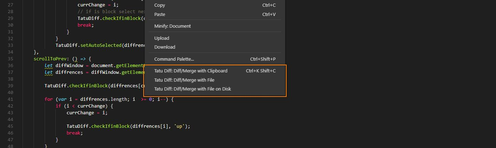

# tatu-diff-merge

Tatu diff merge is a side by side diff with merge capabilities.  
It's not that fancy but it allows to quickly merge from the clipboard or against a file.

### main features
* diff/merge with clipboard
* diff/merge with file

## Key bindings
When you have the Diff window open, there are some shortcuts you can use.

 * <kbd>&downarrow;</kbd> *Scroll and select next diff*  
 * <kbd>&uparrow;</kbd> *Scroll and select previous diff*
 * <kbd>&rightarrow;</kbd> *Merge selected lines*
 * <kbd>Backspace</kbd> *Delete selected lines*
 * <kbd>Esc</kbd> *Close diff window*
 * <kbd>Shift</kbd> + mouse click *Select multiple lines*  
 * <kbd>Ctrl</kbd> + <kbd>s</kbd> or for mac users <kbd>&#8984;</kbd> + <kbd>s</kbd> *Save result (and close the diff)*
 * <kbd>Ctrl</kbd> + <kbd>c</kbd> or for mac users <kbd>&#8984;</kbd> + <kbd>c</kbd> *Copy selected lines from the left diff*  

 ## Roadmap
 * Add history (so you can undo changes)

 ## Known issues
 * No syntax highlighting
 * Can't edit left or right side